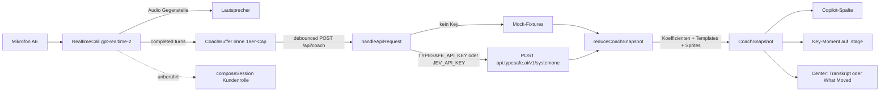
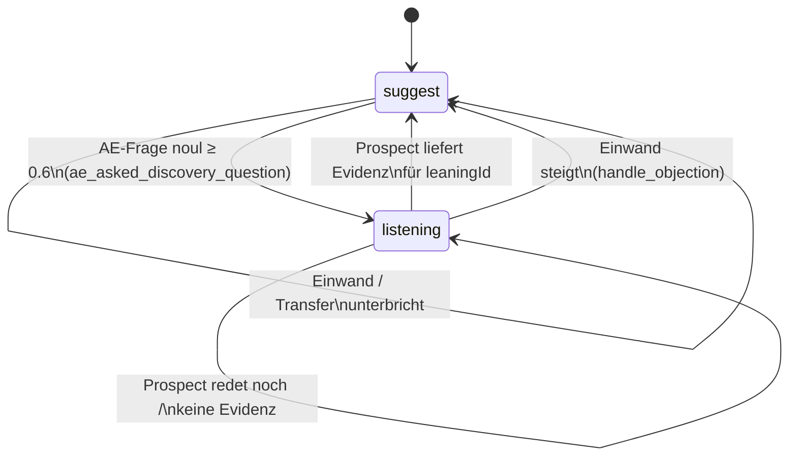

# Jev Sales Copilot → Logicc Call Trainer

**Status:** Plan only (dieses Dokument + `shared/coach.ts`). Keine UI, keine `/api/coach`-Route, kein TypeSafe-HTTP in diesem PR.

**Quelle:** Moritz Kremb, „Sales Copilot using Jev“ — [Tweet](https://x.com/moritzkremb/status/2102537239662096658). Demo ~81 s, CloudTalk × Madrid SDR Qualification, lokales Dashboard `127.0.0.1:8000`, Modell `jev-1.13.0`.

**TypeSafe:** [docs.typesafe.ai](https://docs.typesafe.ai) · `POST https://api.typesafe.ai/v1/systemone` · Primitives Choice / Score / Noul. Jev erzeugt **keinen** Fließtext.

**API-Key:** noch nicht vorhanden. Stubs `TYPESAFE_API_KEY` / `JEV_API_KEY`. Niemals Secrets erfinden, niemals `VITE_`-Prefix.

---

## 1. Warum so und nicht „Realtime coacht mit“

Im Call Trainer ist `gpt-realtime-2` **nur die Gegenstelle** (Empfang / Entscheider). Coaching-Pause und Debrief sind bereits gesprochene Modi über dieselbe Realtime-Session (`prompts/modes/coaching.md`, `debrief.md`).

Der Jev-Copilot ist ein **stilles Overlay während des Rollenspiels**:

| Schicht | Wer | Darf |
| --- | --- | --- |
| Stimme + Kundensimulation | OpenAI Realtime | Sprechen, Durchstellen, Innenlage hüten |
| Typed decisions (Phase, Signale, Move-ID) | Jev / Mock | Choice / Score / Noul + Wahrscheinlichkeiten |
| Schwellen, Close-%, Scripts, UI | **Code** | Koeffizienten, deutsche Sag-Zeilen, Hysterese |
| Gesprochenes 5-Punkte-Coaching | Realtime im Modus `coaching` | Unverändert lassen |

Jev kann die grün hinterlegte **«Sag:»**-Zeile nicht schreiben. Die Demo mappt eine Move-Choice auf Templates. Logicc macht dasselbe auf Deutsch.

---

## 2. Demo-Panels (Videoanalyse ~81 s + Keyframes)

Dunkles Dashboard, Header: `Sales Copilot · live closing probability with Jev` · `jev-1.13.0` · Latenz ~1,0–1,6 s · Kosten/Tokens.

### 2.0 Bestätigtes Layout (Vollvideo)

```
┌─────────────────────────────┬──────────────────────────────────┐
│ THE CALL (Video + Captions) │ CALL STAGE chips + confidence    │
│   └ Key Moment sprite       │ NEXT BEST MOVE (suggest|listen)  │
│     bottom-left im Player   │ LIVE SIGNALS 2-Spalten-Grid      │
├──────────────┬──────────────┤ WHAT MOVED (rechts, Top-3)       │
│ CLOSING %    │ TRANSCRIPT   │                                  │
│ Sparkline    │ Talk-share / │                                  │
│ pts-Delta    │ WPM  — oder  │                                  │
│              │ What Moved   │                                  │
└──────────────┴──────────────┴──────────────────────────────────┘
```

- **Oben links:** Video + Captions. Logicc-Äquivalent: `.stage` (Status, Talk-Button, optional letzte Caption).
- **Unten links:** große Close-/Termin-% + Sparkline + pts-Delta.
- **Unten mitte:** Transkript + Redeanteil/WPM; **wechselt zeitweise** auf «What Moved the Number».
- **Rechts, oben nach unten:** Call Stage → Next Best Move → Live Signals.

Nicht 1:1 YouTube nachbauen. Dieselbe Informationsarchitektur im Logicc-Look (Fraunces / IBM Plex, petrol/amber).

### 2.1 THE CALL + Key-Moment-Sprites (MVP)

Video/Replay + Captions, Zähler `9/48 utterances`. Im Player sitzt **unten links, halbtransparent** ein Sprite:

| Call-Zeit | Overlay |
| --- | --- |
| ~1:01 | `Key Moment` / `BANT: Timeline` (blaues Akzentquadrat, Titel + Kicker) |
| ~1:35 | weiteres Key Moment, während der Rep nachfasst |

Das ist **kein** LLM-Satz und **kein** Stage-Wechsel. Es ist ein rising-edge Chip, wenn ein Noul/Score eine Schwelle kreuzt (hier: `timeline_known`). Die Stage blieb in der Demo durchgängig **discovery** (Confidence 0,95–0,99), während Timeline trotzdem als Sprite feuert.

Logicc: dasselbe Sprite **auf der Call-Fläche** (`.stage`, unten links, Talk-Button nicht überdecken). Copy fest im Code (`KEY_MOMENT_SPRITES` in `shared/coach.ts`). Details: Abschnitt 8.1.

### 2.2 CALL STAGE

Chips: `opening → discovery → qualification → pitch/demo → objection/handling → pricing → closing` plus Confidence.

**Beobachtung Vollvideo:** Stage **bleibt discovery** (0,95–0,99), obwohl Timeline und Pain kommen. BANT-Hits sind Key Moments, keine Stage-Sprünge. Hysterese härter als „bei Timeline → qualification“.

Logicc-AE (RheinSicher): Ziel ist ein **30-Min-Discovery**, kein Kauf.

`opening → discovery → qualification → value → objection → next_step`

`pricing` / `closing` nur als graue v2-Chips. Am Empfang eigenes Set (siehe Schema).

### 2.3 NEXT BEST MOVE (State Machine)

Karte wechselt nicht nur den Titel — sie hat **drei Phasen** (Demo, discovery-Call):

1. **suggest** — Intent + Rationale + 2–3 Scripts, eine Zeile `say:` grün.  
   *Ask a discovery question* → `What's the most painful part of the current process for you?`
2. **listening** — sobald der Rep die Frage **stellt**: Titel `Listening… (leaning Quantify the pain)`. Sag-Zeile ausgeblendet/gedimmt. Nicht mit einem neuen Script dazwischenfunken.
3. **next_intent / suggest(next)** — nachdem der Prospect den Schmerz **artikuliert** (`pain_identified` → 1,00): *Quantify the pain* mit  
   `Roughly how many hours a week does that eat up across the team?` / `How many jobs a month slip because of that?`

Logicc: dieselben Phasen, deutsche Templates. Maschine: Abschnitt 7.1.

### 2.4 LIVE SIGNALS

Zwei Spalten, Werte 0.00–1.00 oder `high` / `low`, grüner/roter Punkt.

**Beobachtung:** `Pain identified` 0,02 → **1,00**, wenn der Prospect den Schmerz nennt. Das ist der Trigger für Phase 3 *und* (Schwelle 0,7) für das Pain-Sprite.

Weitere Demo-Signale: Prospect committed, agrees with rep, decision maker, buyer engagement, urgency, disengaging, competitor, talking too much, buying signal, next step, budget, timeline, rapport, objection open, buyer confused, pitching features, asked discovery question.

Logicc übernimmt die Menge, filtert nach Persona (am Empfang keine Budget-Discovery).

### 2.5 CLOSING / TERMIN-% + «What Moved the Number»

Große Prozentzahl + Delta + Sparkline + gestrichelte „instant estimate“.

**Beobachtete Kurve (Vollvideo, kanonisch für Mock):**

| Beat | % | Was passiert |
| --- | --- | --- |
| Einstieg | **33 %** (+1) | Discovery, Pain 0,02, Urgency low |
| Buying signal | **42 %** | Attribution-Panel: u. a. Buying signal (Keyframe-Stills zeigen daneben Urgency +9,8 / Talk-too-much +4,6; die **Kopf-Delta** kann größer sein als eine Zeile) |
| Pain max | **52 %** | `pain_identified` = 1,00, Move = Quantify the pain |

Unten mitte **tauscht** Transkript gegen **What Moved the Number** (Top-3 gewichtete Beiträge der letzten Äußerung), dann zurück. Rechts kann dieselbe Attribution dauerhaft stehen.

Demo-Fußzeile: *change a coefficient, not a prompt.* Pattern [Composite scoring](https://docs.typesafe.ai/patterns/composite-scoring.md).

Logicc-AE: **„Terminwahrscheinlichkeit“**, nicht „Abschluss“. SDR: „Terminchance 20 Min“. Attribution-Panel: Abschnitt 8.2.

### 2.6 Transcript-Leiste

Pro Turn Mini-%, Redeanteil, WPM. WPM braucht `at` auf Turns — in Logicc erst mit Zeitstempel (Phase 2 für Tempo, Transkript selbst ist MVP).

---

## 3. Ist-Zustand im Repo (wo andocken)

Vanilla Vite, kein React. Prod: `logicc-peach.vercel.app`. Hobby-Functions, `maxDuration: 10`.

### 3.1 Realtime / Transkript

| Datei | Rolle |
| --- | --- |
| `src/realtime.ts` | WebRTC + Data-Channel. Transkript: User fertig bei `conversation.item.input_audio_transcription.completed`; Assistant fertig bei `response.output_audio_transcript.done` / `response.done`. **`turns` wird auf 18 gekürzt** (`slice(-18)`). Live-Deltas feuern `onTranscript` sehr oft. |
| `src/types.ts` | `TranscriptTurn { id, role, text, live? }` — **kein `at`**. |
| `src/main.ts` | Verdrahtet Call, Modi, Auto-Transfer. `onUserUtterance` → nur Sprachbefehle (`shared/commands.ts`). `onTranscript` → `renderTranscript`. Transfer: `keepTranscript: true`, neue Session, Entscheider ohne Empfangs-Transkript. |
| `src/history.ts` | `localStorage`, max. 8 Calls, ohne Coach-Snapshot. |

**Implikationsregel:** Jev **nicht** an Live-Deltas hängen. Eigenen Coach-Buffer **ohne** 18er-Cap führen, Trigger nur auf abgeschlossene Turns.

### 3.2 UI

| Datei | Rolle |
| --- | --- |
| `index.html` | Grid: Persona · Stage · Transkript · Prompt · Historie. Title „Logicc Call Trainer“. |
| `src/ui.ts` | DOM-Renderer, kein Framework. |
| `src/styles.css` | `.grid` zwei Spalten, `max-width: 1120px`. Ab 860 px einspaltig. |

Coach-Panel = neue Grid-Area, Renderer analog `renderTranscript` in `src/ui.ts` (kein React einführen).

### 3.3 API / Session

| Datei | Rolle |
| --- | --- |
| `src/api.ts` | `fetch` zu `/api/health`, `/catalog`, `/compose`, `/session`. |
| `server/http.ts` | `handleApiRequest` — hier später `POST /api/coach`. |
| `server/env.ts` | Nur `OPENAI_*`. Coach-Keys analog ergänzen, nie als Modellname leaken (siehe Test in `tests/vercel-api.test.ts`). |
| `server/session.ts` | Ephemeral OpenAI-Token. Unverändert — Jev nicht in die Realtime-Session mischen. |
| `server/compose.ts` | Prompt-Komposition. Innenlage strippen für UI-Preview. Coach darf die Innenlage **nicht** als State an Jev schicken (sonst spoilert das Overlay den Trainee). |
| `api/*.js` | Dünne Fetch-Wrapper um gebündeltes `api/_handler.js` (`scripts/bundle-api.mjs`). Neue Route = neue `api/coach.js` + Case in `handleApiRequest`. |
| `vercel.json` | SPA-Rewrite ohne `/api/*`. |

### 3.4 Vertriebslogik zum Mappen

- AE: `prompts/sales-ae.md` — Status quo, Pain, Motiv, Entscheider, Wert, Einwand, nächster Schritt.
- Gesprächspfad: `prompts/conversation-logic.md` — Anlass → Person → Relevanz → Status quo → Problem → Impact → Motiv → Wert → Next Step · VMZTA · RRM.
- Empfang: `prompts/gatekeeper.md` — keine Entscheider-Discovery.
- Default-Szenario: `scenarios/rheinsicher-outbound.json` (Versicherung). Vertikale Arbeitsrecht / Praxis / Steuerkanzlei existieren **nicht** — Schema branchenagnostisch, Branche nur als `state.scenario`-Text.
- Auto-Transfer: `shared/handoff.ts` (PR #4). Coach-State über den Transfer hinweg behalten.

---

## 4. Zielarchitektur



### 4.1 Datenfluss pro abgeschlossener Äußerung

1. `RealtimeCall` emittiert fertigen Turn (user **oder** assistant, `live !== true`).
2. `CoachController` (neu, `src/coach-controller.ts`) hängt an internen Buffer, berechnet `wordCounts` / `talkShareAe` in Code.
3. Wenn `mode === "roleplay"` und Copilot an: `POST /api/coach` mit `CoachStatePayload`. In-flight: dirty-Flag, nach Response ggf. ein Replay. Verspätete Responses (`utteranceIndex` älter) verwerfen.
4. Server baut **ein** System-One-Request (Speculative Fan-out, ~20 Fragen). Modell `jev-1.13.0` pinnen (nicht `jev-latest`, sobald Schwellen kalibriert sind).
5. `reduceCoachSnapshot` mischt Answers + Code-Signale + Move-Phase + Templates + Sparkline-Punkt + rising-edge Key Moments + Attribution.
6. UI rendert Snapshot: rechte Copilot-Spalte, Sprite auf `.stage`, Center-Swap Transkript/What-Moved. Realtime-Audio blockiert nie auf Jev (Timeout ~2,5 s → letzter Snapshot bleibt stehen, Badge „veraltet“).

### 4.2 Was Jev *nicht* sieht

- Persona-Innenlage (`interiorByPersona`)
- `OPENAI_API_KEY`
- Rohe Audio-Bytes (Jev ist text-only)
- Den komponierten Kunden-Prompt

State ist nur das, was der Trainee auch hören/sagen konnte, plus Metadaten (`personaId`, `traineeRole`, `goal`, Redeanteil).

### 4.3 Provider-Vertrag

`shared/coach.ts` definiert `CoachSnapshot`. Mock und Live müssen **dieselbe** Shape liefern. UI kennt den Provider nur für das Health-Badge (`mock` | `jev`).

---

## 5. Jev-Fragebogen (Draft, Logicc AE)

Eine Request, alle Fragen parallel. IDs sind nur für Code — die `instructions` müssen allein verständlich sein.

**Sprache:** Transkript ist Deutsch; **Fragen auf Englisch** (Jevs Trainingssprache), mit explizitem Hinweis, dass `utterances` Deutsch sind. Sag-Templates bleiben Deutsch im Code.

**State-Shape** (an Jev):

```json
{
  "meta": {
    "personaId": "entscheider",
    "traineeRole": "ae",
    "scenarioId": "rheinsicher-outbound",
    "goal": "Nach Durchstellung Status quo und Motiv skizzieren, 30-Min-Discovery sichern — kein Close.",
    "talkShareAe": 0.61
  },
  "utterances": [
    { "i": 0, "role": "prospect", "text": "Weber." },
    { "i": 1, "role": "ae", "text": "Guten Tag Herr Dr. Weber, Strauss von Logicc …" }
  ]
}
```

`role: ae` = Trainee, `role: prospect` = Gegenstelle (Empfang oder Entscheider). Nicht OpenAI-`user`/`assistant` an Jev durchreichen.

### 5.1 Choice

#### `call_stage` (Entscheider)

```json
{
  "type": "choice",
  "instructions": "The transcript in `utterances` is a German B2B phone roleplay. `role: ae` is the salesperson. `role: prospect` is the customer. Which stage is the conversation in right now? Pick the latest stage that is actually happening, not a stage the AE merely intended.",
  "criteria": {
    "opening": "Greetings, small talk, who-I-am, why-I-called. No real discovery yet.",
    "discovery": "AE asks how work is done today, problems, or impact. Prospect is describing current process.",
    "qualification": "Budget, authority, need, timeline, or buying process is being explored.",
    "value": "AE ties Logicc to the stated situation after a problem or motive was named. Not a feature dump at the start.",
    "objection": "Prospect is pushing back (already have a solution, send mail, no priority, cost, legal/IT). AE is handling that pushback.",
    "next_step": "They are booking, confirming, or refusing a concrete next meeting. Not a vague 'let's stay in touch'."
  }
}
```

#### `call_stage_gk` (nur spekulativ; Code nutzt sie bei `personaId === "empfang"`)

```json
{
  "type": "choice",
  "instructions": "Same German transcript. If this is a gatekeeper / receptionist call, which stage is it in?",
  "criteria": {
    "opening": "Greeting and identification.",
    "filter": "Gatekeeper is screening: who, company, what about, existing contact.",
    "relevance": "AE states a crisp reason-for-call / benefit without pitching the full product.",
    "transfer_or_mail": "Connect, callback, or 'send an email' is being decided."
  }
}
```

#### `next_move`

```json
{
  "type": "choice",
  "instructions": "What is the single best next move for the AE right now? Prefer one open question over pitching. If the prospect is mid-answer or highly engaged, pick listen_hold. If an objection is live, pick handle_objection. Gatekeeper calls should prefer introduce_crisply, state_reason_for_call, ask_to_transfer, or handle_mail_brush_off.",
  "criteria": {
    "introduce_crisply": "AE has not clearly said name, company, and one-sentence reason.",
    "state_reason_for_call": "Identity is clear but the reason/benefit for this company is missing or fluffy.",
    "ask_to_transfer": "Gatekeeper has enough to connect; AE should ask to be put through.",
    "handle_mail_brush_off": "Gatekeeper offered email / later / we have partners.",
    "ask_discovery": "Decision-maker call; current process, pain, or motivation is not yet understood. Ask an open question.",
    "quantify_pain": "A problem was named in words but hours, money, risk, or missed revenue is not concrete.",
    "validate_motive": "Pain exists but the personal/business motive (control, risk, time, cost) is not confirmed.",
    "map_decision_process": "Need is forming but who else decides, IT/CFO/InfoSec, or timeline is unknown.",
    "handle_objection": "A live objection is blocking progress.",
    "contrast_status_quo": "Prospect named an existing solution; acknowledge then question a gap (RRM Ruin). Do not bash competitors.",
    "propose_next_step": "Enough signal to ask for a 20- or 30-minute slot with a concrete agenda.",
    "confirm_agenda": "A slot was floated; lock date/time/agenda/attendees.",
    "listen_hold": "Prospect is talking, answering, or about to answer. Do not interrupt with a new pitch."
  }
}
```

### 5.2 Score (Rubriken 0–3 → in Code `/ 3` auf 0–1)

```json
{
  "buyer_engagement": {
    "type": "score",
    "instructions": "How engaged is the prospect in the German transcript?",
    "criteria": [
      "Trying to end the call or giving one-word answers.",
      "Polite but thin; answers only when asked.",
      "Explaining the situation in full sentences.",
      "Leaning in: volunteering detail, asking the AE questions, or offering time."
    ]
  },
  "rapport": {
    "type": "score",
    "instructions": "How is the interpersonal tone?",
    "criteria": [
      "Irritated or dismissive.",
      "Neutral / transactional.",
      "Civil and cooperative.",
      "Warm; they acknowledge the AE as relevant."
    ]
  },
  "urgency_stated": {
    "type": "score",
    "instructions": "How much time-pressure did the prospect themselves express (not the AE inventing urgency)?",
    "criteria": [
      "None, or they rejected urgency.",
      "Soft: 'sometime', 'next quarter maybe'.",
      "A real window (budget round, audit, hiring, quarter) without a date.",
      "A date, deadline, or 'we need this before …'."
    ]
  },
  "ae_question_quality": {
    "type": "score",
    "instructions": "Quality of the AE's last few questions. Open, specific, about their world — not stacked product questions.",
    "criteria": [
      "No questions, or only closed yes/no that trap the prospect.",
      "Generic ('how is it going?').",
      "One solid open question about process/pain.",
      "Precise follow-up that builds on what the prospect just said."
    ]
  }
}
```

### 5.3 Noul (0–1)

Jede mit `criteria.true` / `false` kurz kalibrieren. `instructions` immer: *In the German transcript … AE vs prospect.*

| ID | Frage (Kern) |
| --- | --- |
| `pain_identified` | Hat der Prospect ein konkretes Problem genannt (nicht nur der AE behauptet)? |
| `status_quo_understood` | Ist klar, wie die Arbeit heute läuft (Tool, Excel, Kernsystem, …)? |
| `business_impact_quantified` | Zeit, Geld, Risiko, Revision, verpasste Deals — in Zahlen oder klarer Wirkung? |
| `buying_motive_validated` | Persönliches/geschäftliches Motiv bestätigt (Kontrolle, Risiko, Zeit, …)? |
| `decision_maker_identified` | Ist klar, ob Gegenstelle entscheiden darf bzw. wer noch muss? |
| `timeline_known` | Gibt es eine Zeitachse vom Prospect? |
| `budget_discussed` | Budget/Preis konkret angesprochen? (Am Empfang ignorieren.) |
| `competitor_mentioned` | Andere Lösung / „wir haben schon“ / DMS-Projekt? |
| `objection_open` | Liegt ein unbearbeiteter Einwand auf dem Tisch? |
| `prospect_committed` | Hat der Prospect einem nächsten Schritt inhaltlich zugestimmt? |
| `next_step_agreed` | Konkreter Termin/Slot (Tag, Dauer) vereinbart? |
| `buying_signal` | Positives Kauf-/Termin-Signal (Neugier, „wie würde das bei uns laufen“, Zeit anbieten)? |
| `prospect_disengaged` | Zieht sich zurück, will auflegen, „keine Zeit“, Monosyllables? |
| `buyer_confused` | Verwirrt über Angebot, Rolle oder Logik des Anrufs? |
| `ae_pitching_too_early` | AE listet Features, bevor Pain/Motiv da ist? |
| `ae_talking_too_much` | Qualitativ: Monolog, Unterbrechen, keine Pause nach Fragen? (Redeanteil zusätzlich aus Code.) |
| `ae_asked_discovery_question` | Letzte AE-Äußerung war eine offene Discovery-Frage? |
| `prospect_agrees_with_ae` | Prospect stimmt dem AE in der letzten Wende zu? |

Fan-out: alle Fragen **immer** mitsenden. Empfang: `budget_discussed` / `buying_motive_validated` im Reducer ignorieren.

### 5.4 Was *nicht* Jev ist

| Signal | Quelle |
| --- | --- |
| Redeanteil AE / Prospect | Wörter der completed Turns |
| Sparkline-History | Client-Array `number[]` |
| Delta / «What Moved the Number» | Differenz der gewichteten Terme (`moved[]`) |
| Key-Moment-Kicker | `KEY_MOMENT_SPRITES` (feste Strings) |
| Sag-Scripts | `MOVE_SCRIPTS_DE` im Code |
| suggest → listening | `ae_asked_discovery_question` + letzter `role` |
| Stage-Hysterese | `COACH_CONFIDENCE` in `shared/coach.ts` |
| WPM | erst mit `at` auf Turns |

---

## 6. Composite „Terminwahrscheinlichkeit“

Nicht eine Jev-Frage „will they close?“. Demo-Fußzeile ernst nehmen.

Defaults in `shared/coach.ts` → `DEFAULT_NEXT_STEP_WEIGHTS` (AE Entscheider):

```
p = clamp01(
  0.22 * pain_identified
+ 0.18 * urgency          // Score/3 oder Noul-Mix: max(scoreNorm, noul) erst in v2; MVP: Score/3
+ 0.15 * buyer_engagement // Score/3
+ 0.12 * decision_maker_identified
+ 0.10 * buying_motive_validated
+ 0.10 * buying_signal       // Demo: 33 → 42 u. a. durch Buying signal
+ 0.08 * business_impact_quantified
+ 0.08 * rapport          // Score/3
+ 0.07 * next_step_agreed
- 0.15 * objection_open
- 0.10 * ae_pitching_too_early
- 0.08 * ae_talking_too_much
)
percent = round(100 * p)
```

Attribution: für jeden Term `w * value` jetzt minus vorheriger Utterance, Top-3 nach `|delta|`, Anzeige in Punkten (`* 100`) — speist `moved[]` und das What-Moved-Panel (Abschnitt 8.2).

SDR-Gewichte (Phase 2): Transfer-Chance + 20-Min-Slot, höher `ask_to_transfer`-Erfolg, kein Motiv/Impact.

Baseline-Start: 28–35 % nach Begrüßung (Demo startet bei 33 %), nicht bei 0 — sonst wirkt die Sparkline tot.

Gestrichelte Instant-Line: EWMA `0.35 * p + 0.65 * prevInstant`.

---

## 7. Deutsche Move-Templates (Code, nicht Jev)

Platzhalter zur Laufzeit: `{firma}` aus Szenario, `{name}` Entscheider, `{pain}` = letzter Prospect-Satz der Pain erwähnt oder Fallback „der heutige Ablauf“.

| `next_move` | Titel | Sag: (hervorgehoben) |
| --- | --- | --- |
| `ask_discovery` | Offene Discovery-Frage | „Was ist für Sie der mühsamste Teil an dem Ablauf heute?“ |
| `quantify_pain` | Schmerz quantifizieren | „Wenn Sie das grob in Stunden pro Woche übers Team rechnen — wo landest du?“ |
| `validate_motive` | Motiv prüfen | „Wenn das so bleibt: was bedeutet das für Sie persönlich vor der nächsten Revision?“ |
| `map_decision_process` | Kaufprozess | „Wer müsste neben Ihnen noch in so einen 30-Minuten-Termin?“ |
| `handle_objection` | Einwand | „Verstehe. Was davon läuft heute schon sauber — und wo hakt die Übergabe trotzdem?“ |
| `contrast_status_quo` | RRM Ruin | „Kernsystem plus Listen ist üblich. Wo geht Ihnen der Nachweis trotzdem verloren?“ |
| `propose_next_step` | Nächsten Schritt | „Passt ein fester 30-Minuten-Slot diese Woche, Agenda nur Übergaben und Nachweise?“ |
| `confirm_agenda` | Agenda hart machen | „Dann halte ich Donnerstag 10 Uhr fest, 30 Minuten, Sie plus wen aus IT?“ |
| `listen_hold` | Zuhören | *(keine Sag-Zeile, UI: „Nicht unterbrechen — Prospect spricht.“)* |
| `introduce_crisply` | Sauber vorstellen | „Mein Name ist … von Logicc. Kurzer Anruf zu Übergaben in der Vermittlerstrecke — ist Dr. Weber erreichbar?“ |
| `state_reason_for_call` | Anlass in einem Satz | „Wir helfen Versicherern, Übergaben zwischen Vertrieb und Bestand nachziehbar zu machen — ohne das Kernsystem anzufassen.“ |
| `ask_to_transfer` | Durchstellung bitten | „Könnten Sie mich kurz mit Dr. Weber verbinden, 20 Minuten reichen.“ |
| `handle_mail_brush_off` | Mail-Abwehr | „Mail kommt oft unter. Wenn ich in einem Satz den Nutzen für RheinSicher lasse — stellt das die Verbindung her?“ |

Zwei Alternativen pro Move im selben Objekt (`alternativesDe`). Highlight = `sayDe`. In Phase `listening` die Sag-Zeile **nicht** zeigen.

**Confidence-Gating:** `next_move.confidence < 0.45` → vorherigen Move behalten, Karte mit Hint „unsicher“. Stage nur vorwärts bei `confidence ≥ 0.55`, Rückwärts nur bei `≥ 0.7`. **Demo-Lektion:** Timeline-Sprite ≠ Stage-Sprung nach `qualification`.

### 7.1 Next-Best-Move-State-Machine (MVP)

Typen: `MOVE_PHASES`, `NextBestMove.phase` / `leaningId` in `shared/coach.ts`.



Regeln (Code, nicht Prompt):

| Von | Bedingung | Nach |
| --- | --- | --- |
| `suggest(ask_discovery)` | Letzter Turn `role: ae` und `ae_asked_discovery_question ≥ 0.6` | `listening`, `leaningId = quantify_pain` (solange `pain_identified < 0.7`) |
| `listening` + `leaningId=quantify_pain` | Letzter Turn `role: prospect` und `pain_identified` steigt über 0,7 | `suggest(quantify_pain)` inkl. Sag-Scripts Stunden/Jobs |
| `suggest(quantify_pain)` | AE stellt Quantifizierungsfrage | `listening`, `leaningId = validate_motive` |
| beliebig | `objection_open` Rising Edge | `suggest(handle_objection)`, Listening abbrechen |
| `listening` | 2 Prospect-Turns ohne Evidenz | zurück `suggest` derselben ID (nicht eskalieren) |

UI-Copy Listening (Deutsch):

- Titel: **Zuhören …**
- Sub: **(nächster Zug: Schmerz quantifizieren)** — `listeningHintDe`
- `sayDe` hidden; Alternativen hidden
- Live-Signals bleiben sichtbar

`listen_hold` als Choice-Option von Jev bleibt spekulativ; die **Maschine überschreibt** sie, wenn der AE gerade gefragt hat (sonst flattert die Karte zwischen listen_hold und ask_discovery).

Leaning-Map (Entscheider, Default):

| Aktueller Intent | Evidenz-Signal | Nächster Intent |
| --- | --- | --- |
| `ask_discovery` | `pain_identified` | `quantify_pain` |
| `quantify_pain` | `business_impact_quantified` | `validate_motive` |
| `validate_motive` | `buying_motive_validated` | `map_decision_process` |
| `map_decision_process` | `decision_maker_identified` oder `timeline_known` | `propose_next_step` |
| `handle_objection` | `objection_open` fällt unter 0,4 | zurück auf letzten Nicht-Einwand-Intent |

Empfang: `introduce_crisply` → `state_reason_for_call` → `ask_to_transfer` / `handle_mail_brush_off`.

---

## 8. UI-Platzierung

Nicht das CloudTalk-Video 1:1 nachbauen (kein YouTube-Player). Dieselbe **Vier-Zonen-IA** wie im Vollvideo.

**Desktop (≥ 1100 px):** `.app` auf ~1440 px.

```
persona + .stage (Call-Fläche, Key-Moment-Sprite unten links)
termin% + sparkline + delta     |  coach rechts: Stage → Move → Signals
transcript  XOR  what-moved     |  (moved top-3 kann zusätzlich unter Signals stehen)
prompt (details)  |  history
```

`coach` ~360 px. Prompt bleibt `<details>`.

**Tablet/Mobile:** Coach unter dem Transkript, Sprite weiter auf `.stage`; What-Moved als ausklappbare Zeile unter der %.

**Toggle** in der Setup-Zeile: „Copilot“ an/aus, Default an für AE-Rollenspiel. Aus = kein `/api/coach`, kein Sprite.

**Header-Badge** neben `#health`: `Copilot Mock` oder `Jev 1.13.0 · 1.1 s`.

**Modi:**

- `roleplay`: live inkl. Sprites + Move-Maschine.
- `coaching`: Snapshot einfrieren, Sprite aus, Banner „Coaching-Pause — Overlay wartet“. Gesprochener Coach bleibt Realtime.
- `demo`: Overlay optional (Phase 2).
- `debrief`: letzten Sparkline + Signale + gefeuerte Key Moments als stille Liste.

Talk-Button nicht vom Sprite überdecken.

### 8.1 Key-Moment-Sprite (MVP-Pflicht)

Komponente: `renderKeyMoment(stageEl, event)` in `src/ui.ts` — **kein** Canvas-Sprite-Sheet zur Laufzeit, aber visuell der Demo nachempfunden (Keyframes: blaues Quadrat + Titel „Key Moment“ + Kicker „BANT: Timeline“, halbtransparent, unten links im Player).

**Look:**

- `position: absolute; left: 16px; bottom: 16px` innerhalb `.stage` (`position: relative`)
- Dunkle Fläche ~55 % Opacity, 1 px `var(--line)`, Radius 12 px, Padding 10/14
- Links 36×36 petrolfarbenes Quadrat (`--empfang`), Mark wie `.mark`
- Kicker 11 px uppercase muted: `Schlüsselmoment`
- Zeile 14 px: aus `KEY_MOMENT_SPRITES[].kickerDe` (fest, **kein** LLM)
- Fade-in 200 ms, Hold **5 s**, Fade-out 400 ms
- Max. 1 sichtbar; Queue FIFO wenn zwei Edges in <5 s
- `aria-live="polite"`

**Trigger-Map** (`KEY_MOMENT_SPRITES` + Reducer, rising edge):

| Sprite-ID | Signal | Schwelle | Deutsche Kicker |
| --- | --- | --- | --- |
| `timeline` | `timeline_known` | 0,60 | BANT: Zeitachse |
| `pain` | `pain_identified` | 0,70 | Schmerz genannt |
| `decision_maker` | `decision_maker_identified` | 0,60 | Entscheider klar |
| `budget` | `budget_discussed` | 0,60 | BANT: Budget |
| `competitor` | `competitor_mentioned` | 0,55 | Wettbewerb genannt |
| `buying_signal` | `buying_signal` | 0,50 | Kaufsignal |

Regeln:

- Feuer nur wenn `prev < threshold ≤ now` (Rising Edge).
- Pro `id` **einmal pro Call**, außer das Signal fällt unter 0,25 und steigt erneut (Re-Arm).
- Am Empfang: `budget` / `pain` nicht feuern (Discovery-Spoil). Empfang-Sprites: eher `decision_maker` unnötig; optional später `transfer`-Moment.
- Mock-Trajectory muss Timeline-Sprite und Pain-Sprite an denselben Indizes zünden wie die Move-Maschine.

Kein zweiter Textgenerator. Wenn Jev unsicher ist (`confidence` niedrig auf verwandter Choice), Sprite trotzdem nur am Noul-Edge — Noul hat kein `confidence`; Schwelle bewusst hoch.

### 8.2 «What Moved the Number» (MVP-Pflicht)

Nicht nur eine Fußzeile unter der %.

1. **Immer** unter der Sparkline: Delta-Headline (`+9 pts`).
2. **Center-Swap:** wenn `|deltaPts| ≥ COACH_CONFIDENCE.movedPanelPts` (3), `#transcript-wrap` für **6 s** durch Attribution ersetzen (Talk-share-Bar bleibt als dünne Zeile), dann zurück. `CoachSnapshot.centerPanel`.
3. **Rechte Spalte:** Block `Was die Zahl bewegt hat` mit Top-3 `moved[]` (Label + signed pts, eine Dezimalstelle wie Demo `+9.8 pts`).

Zeilen aus der Differenz der gewichteten Terme, nicht aus Jev-Prosa. Tests: Pain 0,02→1,00 bei Gewicht 0,22 ≈ +21,6 pts Anteil — Dummy-Fixture so kalibrieren, dass die **sichtbare** Kurve 33→42→52 der Demo folgt (andere Terme können gegenläufig sein).

---

## 9. Mock vs. Live (Key-Pfad)

### 9.1 Env (Server only)

`.env.example` (Kommentare, keine Fake-Keys):

```
# TYPESAFE_API_KEY=
# JEV_API_KEY=
```

Auflösung: `TYPESAFE_API_KEY || JEV_API_KEY`. SDKs defaulten auf `TYPESAFE_API_KEY` ([Quick start](https://docs.typesafe.ai/introduction/quickstart.md)).

Vercel: Variable in **Production und Preview**, danach Redeploy. Nicht in `OPENAI_REALTIME_MODEL` stecken (bereits ein Footgun, Test schützt nur OpenAI).

`/api/health` erweitern:

```json
{ "ok": true, "hasApiKey": true, "hasTypesafeKey": false, "coachProvider": "mock", "model": "gpt-realtime-2" }
```

`hasTypesafeKey` nur Boolean, nie den Key.

### 9.2 `POST /api/coach`

Request: `CoachStatePayload` (Turns bereits completed, max. ~16 für Jev-State; Sparkline separat clientseitig).

Response: `CoachSnapshot`.

Ohne Key → **200 + Mock**, nicht 503. Rollenspiel soll ohne TypeSafe weiterlaufen. OpenAI-Key bleibt Pflicht nur für `/api/session`.

Mit Key → `fetch` zu TypeSafe. Prefer **rohes `fetch`** in `server/jev.ts` (wie OpenAI in `session.ts`), SDK `@typesafe-ai/sdk` optional. Timeout 2500 ms, Retry nur bei 429/529 mit kurzem Backoff (Hobby 10 s hart).

Fehler → letzter guter Snapshot clientseitig; einmalig `errorEl` nicht spammen (Coach ist best-effort).

### 9.3 Mock-Fixtures

Datei später: `tests/fixtures/coach-mock-trajectory.json`.

Deterministisch über `utteranceIndex` und `personaId`. **Entscheider-Discovery-Kurve an das Vollvideo anlehnen** (Stage bleibt discovery):

| Index | Stage | Move-Phase | Intent | Pain | % | Sprite |
| --- | --- | --- | --- | --- | --- | --- |
| 0–2 Empfang | opening | suggest | introduce_crisply | — | 30 | — |
| 6–8 | transfer_or_mail | suggest | ask_to_transfer | — | 40 | — |
| nach Transfer 9 | discovery 0,95 | suggest | ask_discovery | 0,02 | **33** | — |
| AE fragt Discovery | discovery | **listening** (leaning quantify_pain) | ask_discovery | 0,02 | 34 | — |
| Timeline im Talk | discovery | listening | | 0,05 | 36 | **BANT: Zeitachse** |
| Buying signal | discovery | listening | | 0,10 | **42** | optional Kaufsignal |
| Pain artikuliert | discovery | **suggest** quantify_pain | quantify_pain | **1,00** | **52** | **Schmerz genannt** |
| AE quantifiziert | discovery | listening (leaning validate_motive) | quantify_pain | 1,00 | 53 | — |

Center-Swap auf What-Moved bei den Sprüngen 33→42 und 42→52.

Unit-Test: Reducer + Mock-Provider ohne Netz; extra Tests für Rising-Edge-Sprites (kein Double-Fire) und suggest→listening→suggest.

---

## 10. Phasen

### MVP (Cursor-Durchlauf 1) — Overlay mit Mock

1. `CoachBuffer` in `src/realtime.ts` oder Controller: completed Turns, `at: Date.now()`, **kein** 18er-Cap für den Buffer (UI-Transkript unverändert kappen).
2. `POST /api/coach` + `api/coach.js` + Health-Flag; immer Mock.
3. `src/ui.ts`: `renderCoach(root, snapshot)` — Stage-Chips, Next-Move-Karte **mit Phasen**, Signale, große %, Sparkline (SVG polyline reicht).
4. **Key-Moment-Sprite** auf `.stage`: `renderKeyMoment` + Trigger-Map aus `KEY_MOMENT_SPRITES` (Rising Edge). Mock muss Timeline- und Pain-Sprite zünden. Kein LLM-Text.
5. **Next-Best-Move-State-Machine** `suggest → listening → suggest(next)` (Abschnitt 7.1), inkl. Listening-Copy ohne Sag-Zeile.
6. **What-Moved-Panel:** Top-3 unter Signals **und** Center-Swap Transkript ↔ Attribution bei `|deltaPts| ≥ 3`.
7. `index.html` + CSS Grid gemäß Abschnitt 8; Toggle Copilot; `.stage { position: relative }`.
8. `main.ts`: nach completed transcript (nicht nur `onUserUtterance`) `coach.ingest`. Assistant-Turns zählen mit.
9. Tests: Mock-Trajectory 33→42→52, Sprite rising-edge, Move-Phasen, Health `hasTypesafeKey: false`.
10. Browser: Rollenspiel ohne TypeSafe-Key — Panel, Sprite, Listening-Zustand und What-Moved entlang der Fixture-Kurve.

**Nicht in MVP:** echtes Jev, WPM, Debrief-Merge, Vertikalen, Koeffizienten-UI, Video-Replay.

### Phase 2 — Live Jev

1. `server/jev.ts` + Env. Modell `jev-1.13.0`.
2. Ein Batch = volles Schema Abschnitt 5.
3. Reducer inkl. Gewichte, Attribution, Hysterese, Move-Maschine, Sprite-Edges, Templates.
4. Debounce/dirty/stale-index.
5. Deutsche Testdateien: 3 Mini-Transkripte (Empfang-Mail-Abwehr, Entscheider-Pain, Einwand „haben Lösung“) → Snapshot-Snapshots in Tests mit recorded Jev-Answers **als Fixture** (kein Live-Key in CI).
6. Header-Telemetrie: model, latencyMs, tokens.
7. Transfer: Buffer behalten, `personaId` wechselt → Gatekeeper- vs Entscheider-Reducer umschalten, Sparkline weiter.

### Phase 3 — Feinschliff Trainer

1. SDR-Fragebogen + SDR-Gewichte.
2. Confidence-gated Scripts; Listening blendet Sag-Zeile aus (`listen_hold` vs. Maschinen-`listening` nicht doppelt bauen).
3. Optional Mini-LLM **nur** für Slot-Fill (`{pain}` aus letztem Satz reicht oft ohne LLM).
4. Coach-Timeline in lokale History.
5. Feature-Flag `LOGICC_COACH=0` auf Vercel zum Abschalten.

### v2

- Zeitstempel → Rede-Tempo (WPM wie Demo-Mitte).
- Debrief-Prompt um Coach-Kennzahlen **und gefeuerte Key Moments** ergänzen (weiterhin ohne Innenlage).
- Vertikalen Arbeitsrecht / Praxis / Steuerkanzlei: nur `state.meta.vertical` + andere Templates, **derselbe** Fragebogen.
- Footer wie Demo: Koeffizienten live editierbar, recompute ohne neuen Jev-Call (cached answers).
- Coming-soon Discovery/Demo-Szenarien: Stage-Set `pitch` zuschalten.
- Optional Caption-Overlay der letzten Live-Zeile auf `.stage` (Demo-Video-Untertitel).

---

## 11. Datei-Touch-Liste (Implementierung, nicht dieses PR)

| Datei | Phase | Änderung |
| --- | --- | --- |
| `shared/coach.ts` | done | Typen, Gewichte, Confidence, `KEY_MOMENT_SPRITES`, `MOVE_PHASES` |
| `docs/plans/jev-sales-copilot.md` | done | dieser Plan |
| `.env.example` | done | kommentierte Key-Stubs |
| `server/env.ts` | MVP | `typesafeKey`, `coachProvider` |
| `server/http.ts` | MVP | `POST /api/coach`, Health-Felder |
| `server/coach-reduce.ts` | MVP/2 | Snapshot: weights, move-machine, sprite edges, moved[] |
| `server/coach-mock.ts` | MVP | Trajectory 33→42→52 + listening + sprites |
| `server/jev.ts` | 2 | `fetch` System One |
| `server/coach-questions.ts` | 2 | JSON-Fragen Abschnitt 5 |
| `api/coach.js` | MVP | wie `api/session.js` |
| `src/types.ts` | MVP | `at?` auf Turns optional |
| `src/realtime.ts` | MVP | `onCompletedTurn`, voller Buffer |
| `src/api.ts` | MVP | `postCoach`, Health-Typ |
| `src/coach-controller.ts` | MVP | debounce, sparkline, stale, sprite queue, centerPanel timer |
| `src/ui.ts` | MVP | `renderCoach`, `renderKeyMoment`, `renderMovedPanel`, Move-Phasen |
| `src/main.ts` | MVP | verdrahten, Toggle, Freeze in Coaching |
| `src/styles.css` | MVP | Grid, `.stage` overlay, chips, sparkline, moved, listening-Karte |
| `index.html` | MVP | `#coach-panel`, Toggle, `#moved-panel` |
| `tests/coach-reduce.test.ts` | MVP | Gewichte, Hysterese, Mock, **sprite rising-edge**, **move phases** |
| `tests/vercel-api.test.ts` | MVP | `/api/coach` ohne Key → mock |
| `tests/fixtures/coach-*.json` | MVP/2 | Trajectory + recorded Jev |
| `scripts/bundle-api.mjs` | — | unverändert (bundled entry `vercel-handler.ts`) |
| `prompts/*` | nicht MVP | Realtime-Kundenprompts **nicht** für Jev umschreiben |
| `README.md` | 2 | Env-Doku Copilot |

`scripts/embed-assets.mjs` nur anfassen, wenn Fragen als Markdown/JSON unter `prompts/` landen. Besser: Fragen als TS-Modul, dann kein Embed nötig.

---

## 12. Risiken

1. **Deutsch.** Jev ist englisch-lastig ([Models](https://docs.typesafe.ai/models.md)). Mitigation: englische Instructions, deutsche State-Texte, Confidence-Hold, 3 Gold-Transkripte vor Prod. Wenn Stage ständig flackert: weniger Choice-Optionen, mehr Nouls + Code.
2. **Jev schreibt keine Scripts.** Wer „ Sag-Zeile vom Modell“ erwartet, baut versehentlich ein zweites LLM in den Hot Path. Templates first.
3. **18-Turn-Cap.** Sparkline und Pain-Recall sterben sonst. Extra-Buffer Pflicht.
4. **Live-Deltas.** Ungefiltertes `onTranscript` = DoS gegen `/api/coach` und Token-Rechnung. Nur completed.
5. **Zwei Coaching-Metaphern.** Overlay vs. „Kurz raus“. UI muss den Unterschied in einem Satz sagen.
6. **Zielmetrik.** „Closing probability“ aus der Demo ist für RheinSicher falsch (kein Close). Copy: Terminwahrscheinlichkeit.
7. **Innenlage-Leak.** Coach-State darf `interiorByPersona` nicht enthalten — sonst sieht der Trainee die Lösung im Panel.
8. **Transfer.** Neue WebRTC-Session, Stimme wechselt. Coach muss `personaId` wechseln, Verlauf behalten.
9. **Vercel Hobby 10 s + Cold Start.** Jev ist schnell (~1 s in der Demo), aber Function-Cold-Start + OpenAI parallel. Coach-Route schlank halten, kein Compose der Realtime-Prompts dort.
10. **Kosten.** Demo-Header zeigte zehntausende Tokens in ~10 Requests (State wiederholt). Window hart auf letzte 12–16 Turns + kurzes `goal`. Output-Tokens sind laut Docs frei; Input zählt ($0.042 / MTok).
11. **CI ohne Key.** Recorded fixtures, nie Live-Jev in `vitest`.
12. **Rate limit 429/529.** Dirty-Replay nicht in einer engen Schleife.
13. **Vertikalen fehlen.** Schema nicht an „RheinSicher“ hart kodieren außer in Mock-Texten.
14. **Geheimnisse.** Gleicher Footgun wie `OPENAI_REALTIME_MODEL`: Key-ähnliche Strings nicht in Health `model` schreiben.
15. **Sprite-False-Positives.** Ein einmaliges Noul-Zucken über 0,6 zeigt „Zeitachse“, obwohl niemand ein Datum gesagt hat. Mitigation: Schwellen hoch, Re-Arm nur nach Drop unter 0,25, am Empfang Discovery-Sprites aus.
16. **Listening vs. `listen_hold`.** Zwei Mechanismen (Jev-Choice vs. Code-Maschine) dürfen die Karte nicht gegeneinander flackern — Maschine gewinnt, solange der AE gerade gefragt hat.

---

## 13. Non-Goals (dieses Feature)

- Realtime-Modell ersetzen oder Jev sprechen lassen.
- Video-Replay wie CloudTalk (Logicc bleibt Audio + `.stage`; Sprite sitzt dort).
- Netlify.
- React/Vue einführen.
- TypeSafe-Key im Browser.
- Automatisches Durchstellen ändern.
- Produktclaims erfinden, die nicht in `modules/product/logicc.json` stehen (Scripts dürfen nur erlaubte Claims).

---

## 14. Cursor-Ausführungsreihenfolge

Wenn der nächste Agent bauen soll, in einem Chat:

1. Diesen Plan und `shared/coach.ts` lesen.
2. MVP-Abschnitt 10 strikt: Mock-API + UI **inklusive Sprite, Move-Maschine, What-Moved**, **kein** TypeSafe-HTTP bis Fixture-Indizes 33→42→52, Timeline-Sprite und Listening-Karte sichtbar sind.
3. Erst dann Phase 2, Key aus `.env.local`, niemals committen.
4. Nach UI-Änderungen Browser-Check: Copilot-Toggle; Empfang→Transfer→Entscheider (Sparkline + bereits gefeuerte Sprites bleiben); Coaching-Pause friert Sprite; Mock-Kurve zeigt Listening ohne Sag-Zeile; What-Moved swapped das Transkript nach einem Sprung; Auflegen setzt Sprite-once-flags zurück.
5. `npm test` grün, `CHECKPOINTS.md` fortschreiben.

Playground zum Kalibrieren der Fragen: [console.typesafe.ai](https://console.typesafe.ai) mit einem anonymisierten deutschen Transkript, bevor Schwellen festgezogen werden.

---

## 15. Referenzen

- TypeSafe Intro, Primitives, State, Confidence, Fan-out, Composite scoring, API, Models, JS SDK `@typesafe-ai/sdk`
- Logicc: `src/realtime.ts`, `src/main.ts`, `src/ui.ts`, `server/http.ts`, `prompts/sales-ae.md`, `prompts/conversation-logic.md`, `shared/handoff.ts`
- Typen/Gewichte/Sprites/Phasen: `shared/coach.ts`
